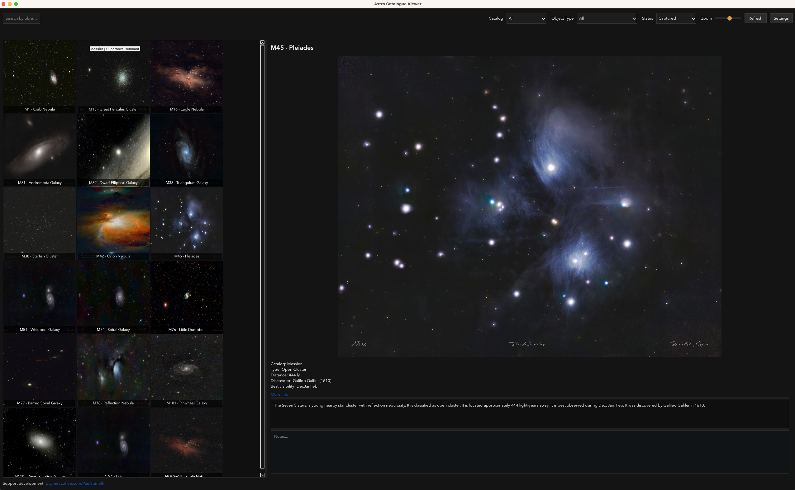
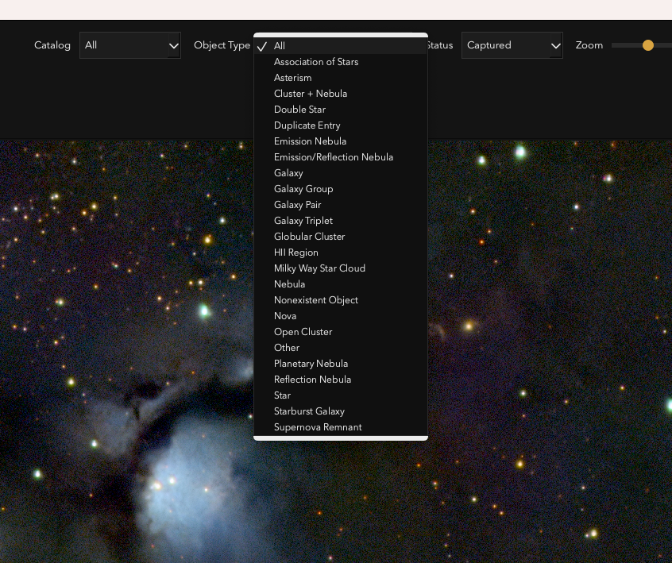
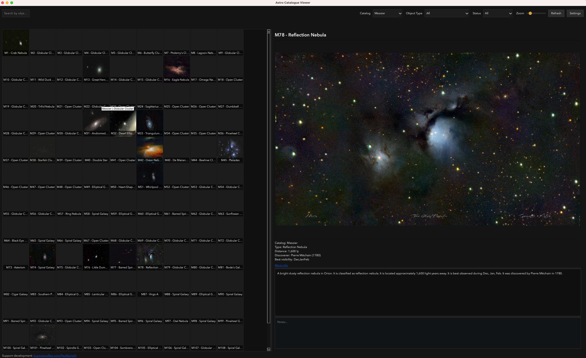
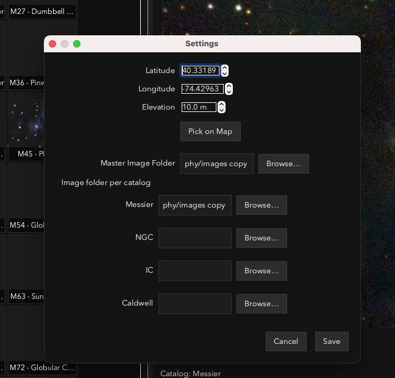
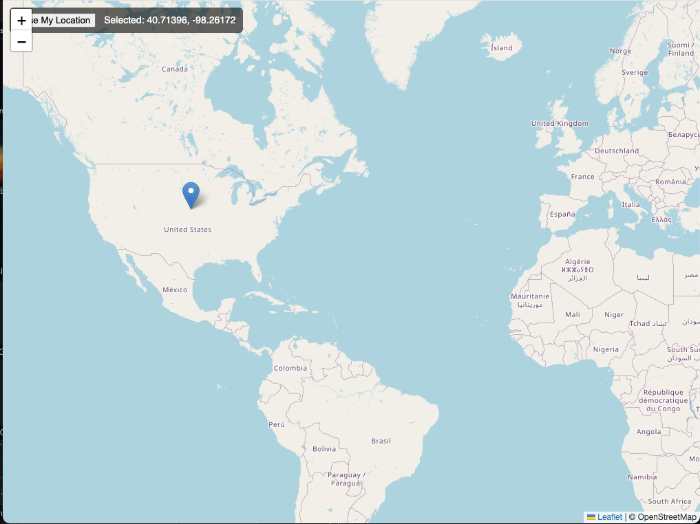
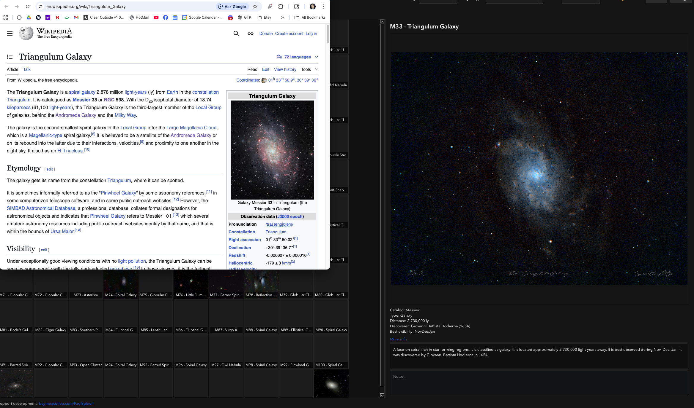

# Astro Catalogue Viewer

Astro Catalogue Viewer is a desktop app for organizing and browsing deep-sky catalog images (Messier, NGC, IC, Caldwell, and more). It provides a fast image grid, filters, object metadata, and notes, so you can track your astrophotography progress and plan what to capture next.

This is the first beta release.

Website: https://astro-catalogue-viewer.com/

## Features
- Fast grid with zoom, search, and filters (catalog, object type, status)
- Image popup
- Notes per object (saved into the metadata JSON)
- Detail panel with image zoom/pan and external info link
- Catalog-aware image matching by filename (e.g., M31, NGC7000, IC5070, C14)
- Master image folder support (if all images live in one place)
- Optional catalog-specific image folders
- Offline-safe location picker (browser-based map)

## Screenshots








## Requirements
- macOS and Windows
- Python 3.13+ (or any Python 3.10+ that supports PySide6)
- PySide6 (`pip install -r requirements.txt`)

## Quick Start
```bash
cd "/Volumes/Audio And Astrophoto/Astro-Catalogue-Viewer"
python3 -m venv .venv
source .venv/bin/activate
python3 -m pip install -r requirements.txt
python3 app/main.py
```

## Windows Build
Clone this repo on Windows and run one of the build scripts (requires Python 3.10+):

PowerShell:
```powershell
python -m venv .venv
.\.venv\Scripts\Activate.ps1
python -m pip install -r requirements.txt
.\scripts\build_windows.ps1
```

CMD:
```bat
python -m venv .venv
.\.venv\Scripts\activate.bat
python -m pip install -r requirements.txt
.\scripts\build_windows.bat
```

The packaged app will be in `dist/`.

## Configuration
Open **Settings** to set:
- **Master Image Folder** (optional): a single folder containing all your images
- **Per-catalog Image Folder**: use if you store catalogs separately
- **Observer Location**: used for best-visibility suggestions

The “best visibility” months are computed from RA/Dec + your latitude/longitude using a sidereal-time approximation. It’s a solid planning heuristic (altitude at midnight on the 15th of each month) and will drive the “Suggested” filter accurately.

### Image Naming
Filenames must include the standard object ID, for example:
- `M31_Andromeda_Galaxy.jpg`
- `NGC7000 North America Nebula.tif`
- `IC5070_Pelican.png`
- `C14 Double Cluster.jpg`

The app matches IDs anywhere in the filename.

## Metadata
Metadata is stored in JSON files under `data/`. Example files included:
- `data/object_metadata.json` (Messier)
- `data/ngc_metadata.json` (sample)
- `data/ic_metadata.json` (sample)
- `data/caldwell_metadata.json` (sample)

Notes you add in the app are saved back into the catalog JSON under the `notes` field.

Messier metadata is complete. The NGC, IC, and Caldwell metadata sets are in progress.

### Resetting saved settings
If the app has a bad image path or filter state saved, delete the config file:
- macOS: `~/Library/Application Support/AstroCatalogueViewer/config.json`

## Support
This project takes time and money to develop. If you find it useful, please consider supporting:
- https://buymeacoffee.com/PaulSpinelli

Feedback, suggestions, and bug reports are welcome via the GitHub repo issues.

## License
See `LICENSE`.
